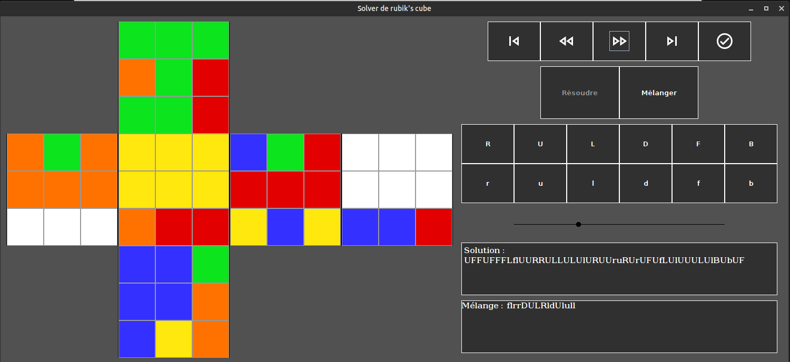

# Rubik's Cube Solver
Un solver de rubik's cube avec interface graphique écrit en Java, sous license GPLv3

Par Adrien Garrel, Alexandre Dumarquez, Paul Morel & Louis Gombert, 2020.

Voir le document explicatif en .docx à la racine du projet. Une version compilée est disponible sous l'onglet releases.


## Lancement de l'application
Le build est fait par Gradle, qui construit un .jar à partir des fichiers source. Le wrapper gradlew est inclus dans le repo.
 ```bash
./gradlew build
java -jar build/libs/cubesolver.jar
```
ou `gradlew.bat build` sur Windows

Un script bash dédié est aussi fourni :
```bash
./launch.sh
```
Sur IDEA, créer une nouvelle configuration de type shell script menant à ce script pour relancer l'applcation rapidement avec Shift+F10 (par défaut).

## Comment contribuer au projet
  1) Regarder quelles issues non assignées sont disponibles
  2) S'assigner l'issue, pour que personne d'autre ne se mette dessus
  3) Faire les changements nécessaires en local
  4) TESTER SON CODE (vraiment)
  5) Créer une nouvelle branche (sur l'IDE, cliquer sur Git: Master dans le coin bas-droit et créer une nouvelle branche) et pousser ses changements dessus
  6) Créer une pull request pour faire valider son code
  7) Quand la branche est rassemblée avec le master, fermer l'issue en question
  
